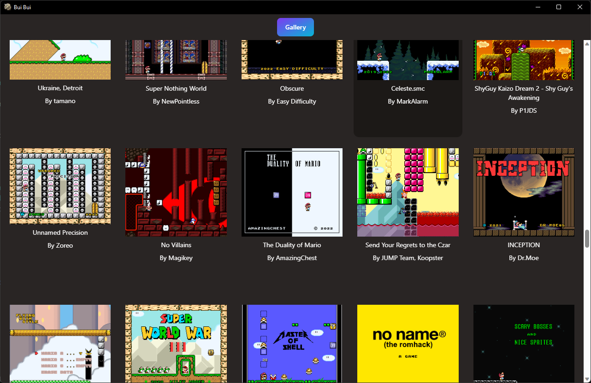

    
    <b>Bui Bui</b>

A Cross Platform Super Mario World Hack Manager

# Features

- Infinite Scroll Super Mario World Central Gallery Browsing
- One-Click Hack Patching via "Add to Collection"
- Launch hacks right from Bui Bui!
- Cross Platform (thanks to [Tauri](https://tauri.app/))

    

# Roadmap

See [our task board](https://github.com/users/ChristopherJMiller/projects/1) and [filed issues](https://github.com/ChristopherJMiller/buibui/issues) to see what's on the horizon.

# Contributing

Thank you for your interest in contributing!

**Set Up**

1. Install [Node](https://nodejs.org/en), [Yarn](https://classic.yarnpkg.com/lang/en/docs/install), and [Rustup](https://rustup.rs/).
2. Install Node dependencies with `yarn install`
3. Run Bui Bui in dev mode with `yarn tauri dev`

**Organization**

- `src-tauri` contains the Rust backend
- `src` contains the React Typescript frontend
  - The frontend uses Redux for all of it's state management
